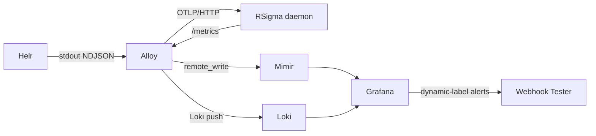

# Security Observability with RSigma and the LGTM Stack

Companion repository for the article [Security Observability with RSigma and the LGTM Stack](https://mostafa.dev/).

A complete, self-contained detection-to-alert pipeline using RSigma, Grafana Alloy, Loki, Mimir, Grafana 12 Alerting with dynamic labels, and a Webhook Tester for inspecting alert payloads. One `docker compose up` and you have a working lightweight SIEM.

## Architecture



## Quick start

Docker requires authentication for pulling from `ghcr.io`, even for public packages. Log in first:

```bash
# With GitHub CLI
gh auth token | docker login ghcr.io -u YOUR_GITHUB_USERNAME --password-stdin

# Or with a personal access token (read:packages scope)
echo $GITHUB_TOKEN | docker login ghcr.io -u YOUR_GITHUB_USERNAME --password-stdin
```

Then start the stack:

```bash
docker compose up -d
```

The first run downloads the Helr binary from GitHub Releases, which takes a few seconds. Subsequent runs use the cached container layer.

Wait about 15 seconds for the stack to initialize, then open:

- **Grafana**: http://localhost:3000 (no login required)
- **Webhook Tester**: http://localhost:8080 (alert notifications UI)
- **RSigma metrics**: http://localhost:9090/metrics
- **RSigma health**: http://localhost:9090/healthz
- **Mimir**: http://localhost:9009

The helr container automatically replays the Okta audit events on startup. To trigger a manual replay via the REST API:

```bash
./scripts/replay.sh
```

## What to expect

After the replay completes, you should see:

1. **Four detection matches** on RSigma's `/metrics` endpoint (proxy session, MFA deactivation, admin role grant, IdP creation).
2. **One correlation match** for the cross-tenant impersonation sequence (`level=critical`).
3. **Grafana dashboard** ("RSigma Detections") showing detection and correlation rates.
4. **Grafana alerts** firing with dynamic `severity` labels:
   - Proxy session (level=high) -> severity=P2
   - MFA/Admin/IdP (level=medium) -> severity=P3
   - Cross-tenant correlation (level=critical) -> severity=P1
5. **Webhook Tester** receiving alert notifications at http://localhost:8080. Open the session URL shown in `docker-compose.yml` comments to inspect the full payloads.

## Scenario

Okta cross-tenant impersonation attack (August 2023). Six sample events, four SigmaHQ detection rules, one custom `temporal_ordered` correlation rule. See the [second article](https://mostafa.dev/streaming-logs-to-rsigma-for-real-time-detection-72084b8041ad) for the full scenario walkthrough.

## Repository structure

```
.
├── docker-compose.yml                         # Full stack (7 services)
├── helr/
│   └── config.yml                             # Helr source configuration
├── recordings/
│   └── okta-audit/
│       └── 000.json                           # Recorded Okta API response
├── alloy/
│   └── config.alloy                           # OTLP fanout + metrics scraping
├── mimir/
│   └── config.yml                             # Mimir monolithic mode config
├── grafana/
│   └── provisioning/
│       ├── datasources/datasources.yml        # Prometheus + Loki
│       ├── dashboards/
│       │   ├── dashboards.yml                 # Dashboard provider
│       │   └── rsigma-detections.json         # Detection dashboard
│       └── alerting/alerting.yml              # Alert rules + dynamic labels
├── rules/                                     # Sigma detection + correlation rules
│   ├── okta_user_session_start_via_anonymised_proxy.yml
│   ├── okta_mfa_reset_or_deactivated.yml
│   ├── okta_admin_role_assigned_to_user_or_group.yml
│   ├── okta_identity_provider_created.yml
│   └── okta_cross_tenant_impersonation_correlation.yml
├── events/
│   └── okta_audit.ndjson                      # 6 sample Okta events (reference)
└── scripts/
    └── replay.sh                              # Manual event replay via REST API
```

## Dynamic label alerting

The key integration between RSigma and Grafana Alerting is the dynamic `severity` label. RSigma's per-rule Prometheus metrics carry the Sigma rule's `level` field as a metric label. The Grafana alert rule uses a Go template to map it to P1-P4 priority:

```go
{{- if eq $labels.level "critical" -}}P1
{{- else if eq $labels.level "high" -}}P2
{{- else if eq $labels.level "medium" -}}P3
{{- else -}}P4
{{- end -}}
```

Notification policies then route by `severity`. In this demo, all routes point to the [Webhook Tester](https://github.com/tarampampam/webhook-tester) service so you can inspect the full alert payloads. In a real-world setup, you would replace these with incident response and management (IRM) tools like PagerDuty or Grafana OnCall for P1, messaging platforms like Slack or Microsoft Teams for P2, and email or a ticket queue for P3-P4.

## Related

- [RSigma](https://github.com/timescale/rsigma) -- Rust toolkit for Sigma detection rules
- [Helr](https://github.com/timescale/helr) -- Log source poller
- [Grafana Alloy](https://grafana.com/docs/alloy/latest/) -- OpenTelemetry collector
- [Grafana dynamic labels](https://grafana.com/docs/grafana/latest/alerting/examples/dynamic-labels/) -- Dynamic label documentation
- [Webhook Tester](https://github.com/tarampampam/webhook-tester) -- Self-hosted webhook receiver with web UI

## License

MIT
